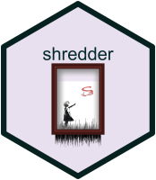

<!-- README.md is generated from README.Rmd. Please edit that file -->

```{r, include = FALSE}
knitr::opts_chunk$set(
  collapse = TRUE,
  comment = "#>",
  fig.path = "man/figures/README-",
  out.width = "100%"
)
```

<hr>

# shredder 

<!-- badges: start -->
[](https://github.com/yonicd/shredder)
[](https://github.com/yonicd/shredder)
[](https://github.com/yonicd/shredder)
[](https://codecov.io/gh/yonicd/shredder?branch=master)
[](http://tinyurl.com/s3fr6gn)
[](https://www.tidyverse.org/lifecycle/#maturing)
<!-- badges: end -->

The goal of __shredder__ is to create an API that incites exploration and iteration of rstan simulation objects. 

  - With this API users can: 
    - Manipulate fit objects without needing to convert arrays into rectangular form.
    - Generate task specifc subsets of the parent fit object for fit diagnostics and post-processing
    - Use pipe operators to create more user-friendly workflows
    - Manipulate various classes that contain a `stanfit` object, such as `rstan` and `brms`.
  - RStudio specific feature: Tab autocomplete in `shredder::stan_select` and `shredder::stan_filter` for the parameter names stored in the fit object.

## Installation

``` r
remotes::install_github('yonicd/shredder')
```

## Current API Verbs

  - chains
      - `shredder::stan_retain` : extract specific chains
  - pars
      - `shredder::stan_select` : extract specific pars
      - `shredder::stan_contains`, `shredder::stan_starts_with`,`shredder::stan_ends_with`:
        partial par extractions (used within `shredder::stan_select`)
      - `shredder::stan_names` : return names within the stanfit object
  - post-warmup samples
      - `shredder::stan_slice` : extract specific samples by index
      - `shredder::stan_thin_n` : Thin (remove) every n samples from the total samples
      - `shredder::stan_thin_frac` : Thin (remove) a fraction of total samples.
      - `shredder::stan_filter` : extract subset of samples conditional on
        filter of parameter values
  - cached elements
    - `shredder::stan_axe` : remove cached elements for stanfit objects to reduce memory usage

## Code of Conduct

Please note that the 'shredder' project is released with a [Contributor Code of Conduct](CODE_OF_CONDUCT.md).
By contributing to this project, you agree to abide by its terms.
