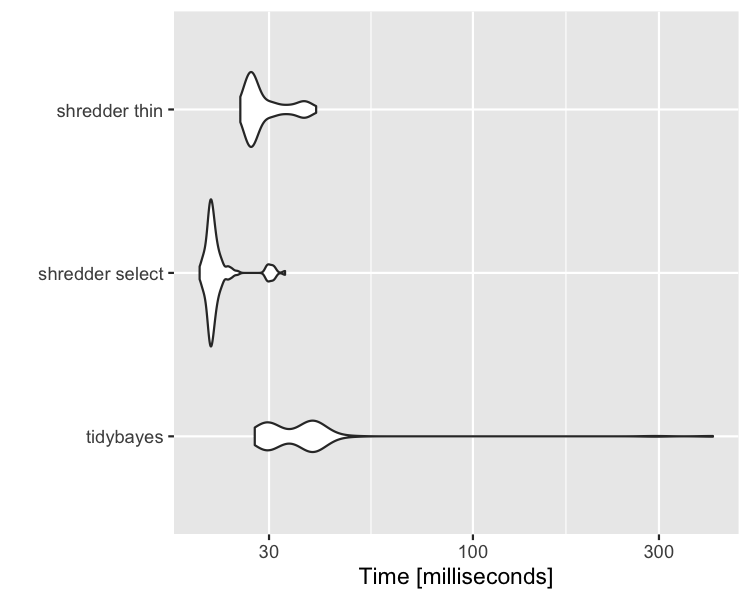

  


```r
library(rstan)
library(shredder)
library(tidybayes)
library(microbenchmark)
rstan_options(auto_write = TRUE)
```

Set seed

```r
set.seed(1234)
```

Run Model


```r
rats <- shredder::rats_example(nCores = 4)
```

## Set up functions

### tidybayes


```r
tb <- function(mod){
  mod%>%
    tidybayes::spread_draws(mu_alpha,mu_beta)  
}
```

### tidybayes with shredder select


```r
sh_select <- function(mod){
  mod%>%
    stan_select(mu_alpha,mu_beta)%>%
    tidybayes::spread_draws(mu_alpha,mu_beta)  
}
```

### tidybayes with shredder thin (every 20th sample)

```r
sh_thin <- function(mod){
  mod%>%
    stan_thin_n(20)%>%
    tidybayes::spread_draws(mu_alpha,mu_beta)
}
```

## Benchmark

### Run benchmark


```r
bench <- microbenchmark(
  "tidybayes" = {tb(rats)},
  "shredder select" = {sh_select(rats)},
  "shredder thin" = {sh_thin(rats)})
```

### Output


```r
ggplot2::autoplot(bench)
```


