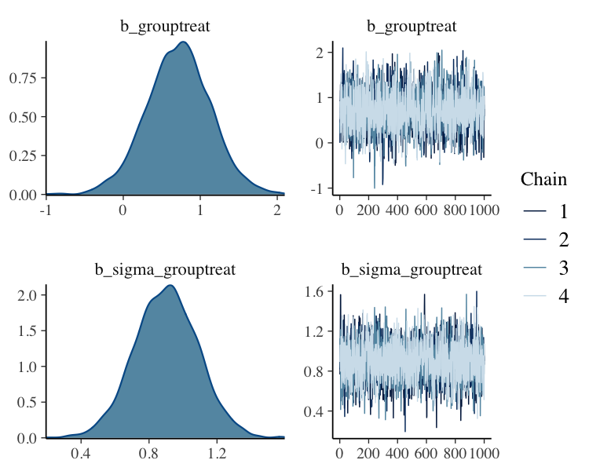
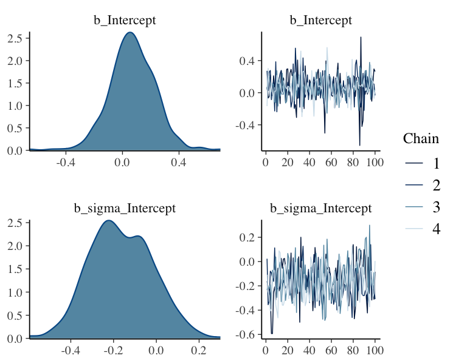
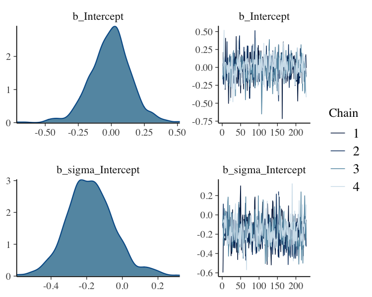
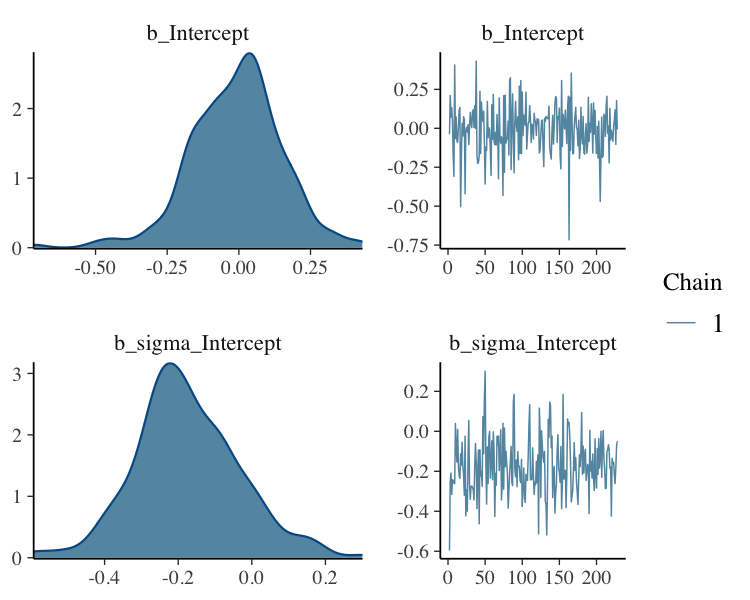

```r
library(shredder)
library(brms)
```

## Generate Data


```r
group <- rep(c("treat", "placebo"), 
             each = 30)

symptom_post <- c(
  rnorm(30, mean = 1, sd = 2), 
  rnorm(30, mean = 0, sd = 1)
)

dat1 <- data.frame(group, symptom_post)
```

## Run Model


```r
fit <- brm(bf(symptom_post ~ group, sigma ~ group), 
           data = dat1, 
           family = gaussian(),
           seed = 1234)
```


```
 Family: gaussian 
  Links: mu = identity; sigma = log 
Formula: symptom_post ~ group 
         sigma ~ group
   Data: dat1 (Number of observations: 60) 
Samples: 4 chains, each with iter = 2000; warmup = 1000; thin = 1;
         total post-warmup samples = 4000

Population-Level Effects: 
                 Estimate Est.Error l-95% CI u-95% CI    Rhat Bulk_ESS Tail_ESS
Intercept         0.06698   0.15800 -0.24173  0.37999 1.00169     5280     2818
sigma_Intercept  -0.17407   0.13197 -0.42005  0.10367 1.00107     3635     2690
grouptreat        0.71749   0.41627 -0.12423  1.53980 1.00066     2569     2354
sigma_grouptreat  0.90143   0.18605  0.53340  1.26824 1.00158     3215     2815

Samples were drawn using sampling(NUTS). For each parameter, Bulk_ESS
and Tail_ESS are effective sample size measures, and Rhat is the potential
scale reduction factor on split chains (at convergence, Rhat = 1).
```


```r
fit%>%
  plot(N = 2, ask = FALSE)
```



## Select first 100 Posterior Samples from each Chain


```r
fit_slice <- fit%>%stan_slice(1:100)
```


```
 Family: gaussian 
  Links: mu = identity; sigma = log 
Formula: symptom_post ~ group 
         sigma ~ group
   Data: dat1 (Number of observations: 60) 
Samples: 4 chains, each with iter = 1100; warmup = 1000; thin = 1;
         total post-warmup samples = 400

Population-Level Effects: 
                 Estimate Est.Error l-95% CI u-95% CI    Rhat Bulk_ESS Tail_ESS
Intercept         0.07013   0.16137 -0.23785  0.38342 1.01057      774      364
sigma_Intercept  -0.16386   0.14627 -0.42317  0.12234 1.00969      403      300
grouptreat        0.71854   0.41869 -0.04519  1.53400 1.01188      296      313
sigma_grouptreat  0.89130   0.19825  0.51367  1.30166 1.00422      344      263

Samples were drawn using sampling(NUTS). For each parameter, Bulk_ESS
and Tail_ESS are effective sample size measures, and Rhat is the potential
scale reduction factor on split chains (at convergence, Rhat = 1).
```


```r
fit_slice%>%
  plot(N = 2, ask = FALSE)
```



## Thin 25% of Posterior Samples from each Chain


```r
fit_thin <- fit%>%
  stan_thin_frac(0.25)
```


```
 Family: gaussian 
  Links: mu = identity; sigma = log 
Formula: symptom_post ~ group 
         sigma ~ group
   Data: dat1 (Number of observations: 60) 
Samples: 4 chains, each with iter = 1250; warmup = 1000; thin = 1;
         total post-warmup samples = 1000

Population-Level Effects: 
                 Estimate Est.Error l-95% CI u-95% CI    Rhat Bulk_ESS Tail_ESS
Intercept         0.06683   0.15555 -0.24601  0.36279 1.00068      952     1033
sigma_Intercept  -0.17761   0.13061 -0.42181  0.08630 1.00249     1022     1012
grouptreat        0.72207   0.41571 -0.07618  1.57548 1.00041     1003      894
sigma_grouptreat  0.90896   0.18475  0.56465  1.28181 1.00050     1052      994

Samples were drawn using sampling(NUTS). For each parameter, Bulk_ESS
and Tail_ESS are effective sample size measures, and Rhat is the potential
scale reduction factor on split chains (at convergence, Rhat = 1).
```


```r
fit_thin%>%
  plot(N = 2, ask = FALSE)
```


## Filter Posterior Samples by Conditional


```r
fit_filter <- fit%>%
  stan_filter(b_grouptreat>=1)
```


```
 Family: gaussian 
  Links: mu = identity; sigma = log 
Formula: symptom_post ~ group 
         sigma ~ group
   Data: dat1 (Number of observations: 60) 
Samples: 4 chains, each with iter = 1228; warmup = 1000; thin = 1;
         total post-warmup samples = 912

Population-Level Effects: 
                 Estimate Est.Error l-95% CI u-95% CI    Rhat Bulk_ESS Tail_ESS
Intercept        -0.00769   0.15381 -0.32381  0.29970 1.00015      957      755
sigma_Intercept  -0.17751   0.13422 -0.42817  0.13153 1.00122      659      794
grouptreat        1.25471   0.20926  1.01099  1.79655 1.00431      605      775
sigma_grouptreat  0.92356   0.20039  0.52929  1.30766 1.00501      614      655

Samples were drawn using sampling(NUTS). For each parameter, Bulk_ESS
and Tail_ESS are effective sample size measures, and Rhat is the potential
scale reduction factor on split chains (at convergence, Rhat = 1).
```


```r
fit_filter%>%
  plot(N = 2, ask = FALSE)
```



## Filter Posterior Samples by Conditional Subset Chain


```r
fit_filter_chain <- fit%>%
  stan_filter(b_grouptreat>=1)%>%
  stan_retain(chains = 1)
```


```
 Family: gaussian 
  Links: mu = identity; sigma = log 
Formula: symptom_post ~ group 
         sigma ~ group
   Data: dat1 (Number of observations: 60) 
Samples: 1 chains, each with iter = 1228; warmup = 1000; thin = 1;
         total post-warmup samples = 228

Population-Level Effects: 
                 Estimate Est.Error l-95% CI u-95% CI    Rhat Bulk_ESS Tail_ESS
Intercept        -0.01025   0.16019 -0.33472  0.30657 1.00007      333      128
sigma_Intercept  -0.17540   0.14239 -0.42458  0.13767 0.99844      157      153
grouptreat        1.21999   0.18977  1.00719  1.70702 0.99858      175      217
sigma_grouptreat  0.92037   0.22289  0.51294  1.35952 1.01292      139      140

Samples were drawn using sampling(NUTS). For each parameter, Bulk_ESS
and Tail_ESS are effective sample size measures, and Rhat is the potential
scale reduction factor on split chains (at convergence, Rhat = 1).
```


```r
fit_filter_chain%>%
  plot(N = 2, ask = FALSE)
```


